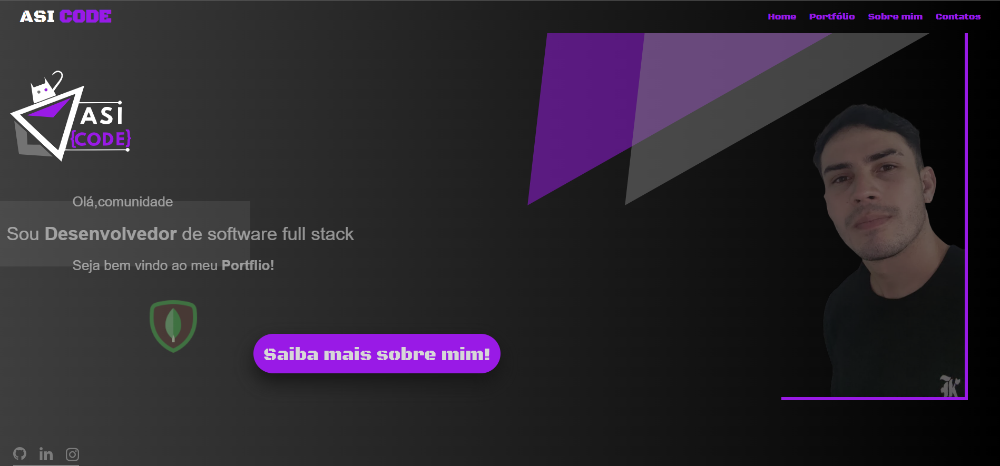
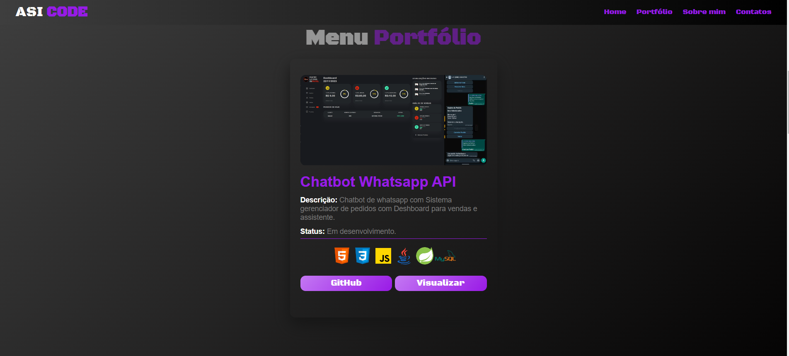
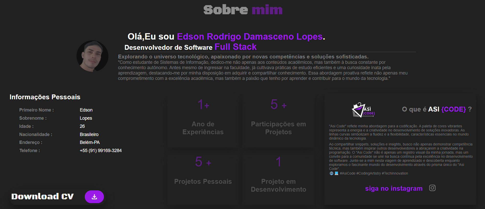
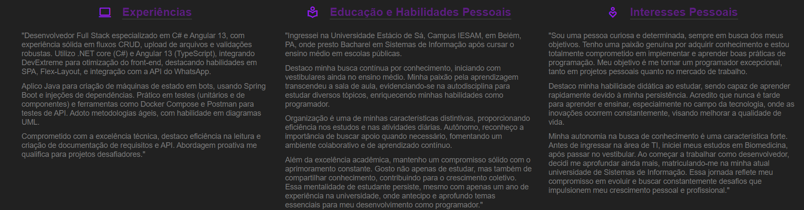
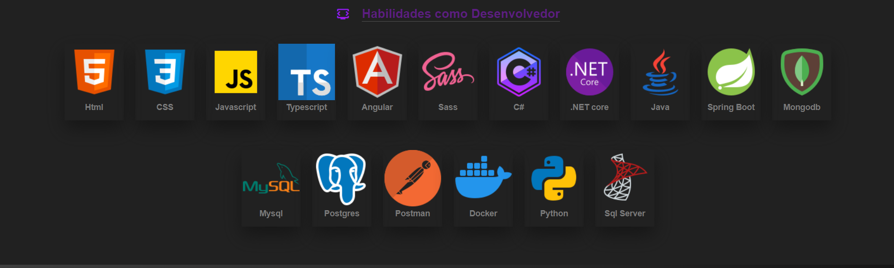
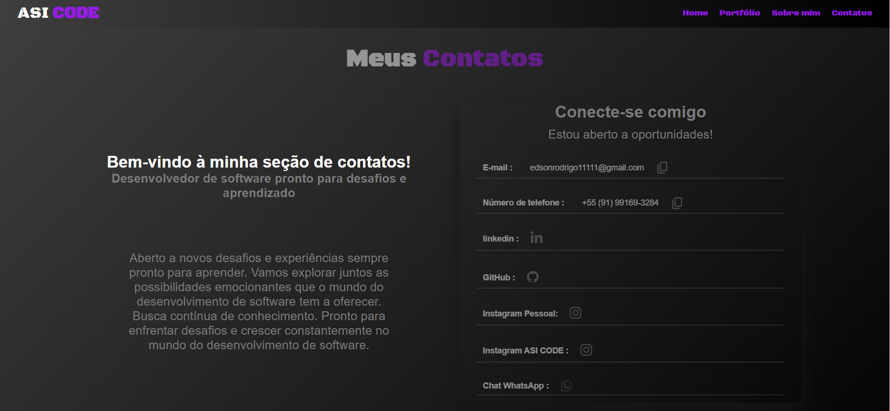

# Projeto Portfólio

Este é um Projeto que criei para um web portfólio para exibir/demostrar minhas habilidades como programador de software full stack e minhas experiências e habilidades.

## Visão Geral  

Esse projeto tem como objetivo anexar meus projetos e habilidades conforme minha evolução como desenvolvedor e auxiliar na visualização das demais características como programador 

## Tecnologias Utilizadas

- **HTMLL:** 

- **CSS:** 

- **Javascript:** 

## Demostração das seções
1. Página inicial

2. Portfólio

3. Sobre mim

4. Meus contatos
